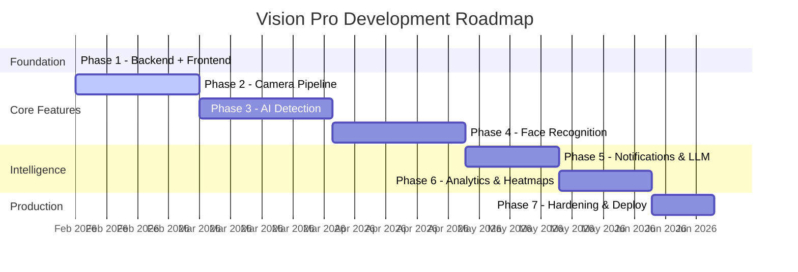

<p align="center">
  
</p>

<h1 align="center">Vision Pro – AI-Powered NVR System</h1>

<p align="center">
  <strong>GPU-accelerated Network Video Recorder with real-time AI detection, face recognition, and intelligent analytics</strong>
</p>

<p align="center">
  
  
  
  
  
  
  
</p>

---

## 📋 Table of Contents

- [Overview](#-overview)
- [Architecture](#-architecture)
- [Tech Stack](#-tech-stack)
- [Project Structure](#-project-structure)
- [Getting Started](#-getting-started)
- [API Reference](#-api-reference)
- [Development Progress](#-development-progress)
- [Roadmap](#-roadmap)
- [Contributing](#-contributing)

---

## 🎯 Overview

**Vision Pro** is a self-hosted, GPU-accelerated Network Video Recorder designed for enterprise-grade security monitoring. It combines real-time object detection (YOLO v5–v11), face recognition (InsightFace/ArcFace), and AI-powered analytics into a modern, single-pane-of-glass interface.

### Key Features

| Feature | Description |
|---------|-------------|
| 🎥 **Multi-Camera RTSP** | Connect unlimited IP cameras via RTSP streams |
| 🧠 **AI Object Detection** | YOLO v5–v11 with GPU inference, customizable models |
| 👤 **Face Recognition** | Real-time identification using InsightFace + vector search |
| 📊 **Smart Analytics** | Detection trends, behavioral analysis, activity heatmaps |
| 🔔 **Multi-Channel Alerts** | Telegram, WhatsApp, Email notifications |
| 🤖 **AI Assistant** | Natural-language queries about security events |
| 🎬 **Smart Recording** | Detection-triggered recording with pre/post event buffers |
| 🔐 **Enterprise Security** | JWT auth, RBAC, encrypted credentials, audit logging |
| 🖥️ **System Monitoring** | Real-time CPU, RAM, Disk, GPU metrics via WebSocket |
| 🔍 **Vector Search** | Semantic event search powered by Qdrant |

---

## 🏗 Architecture

```
┌────────────────────────────────────────────────────────────┐
│                     React + MUI Frontend                   │
│          (TypeScript, Vite, Material UI, Recharts)         │
└───────────────────────┬────────────────────────────────────┘
                        │ REST API + WebSocket
┌───────────────────────▼────────────────────────────────────┐
│                   FastAPI Backend (Python)                  │
│  ┌──────────┐  ┌──────────┐  ┌───────────┐  ┌──────────┐ │
│  │   Auth   │  │ Cameras  │  │  Events   │  │  Faces   │ │
│  │  (JWT)   │  │  (CRUD)  │  │(Detection)│  │ (RecogN) │ │
│  └──────────┘  └──────────┘  └───────────┘  └──────────┘ │
│  ┌──────────┐  ┌──────────┐  ┌───────────┐  ┌──────────┐ │
│  │ Playback │  │ Settings │  │ AI Models │  │Analytics │ │
│  │(Records) │  │(Config)  │  │(YOLO Mgmt)│  │(Trends)  │ │
│  └──────────┘  └──────────┘  └───────────┘  └──────────┘ │
│  ┌──────────────────────────────────────────────────────┐ │
│  │            AI Pipeline (GPU-Accelerated)             │ │
│  │   YOLO Detection → Face Recognition → Embeddings    │ │
│  └──────────────────────────────────────────────────────┘ │
└──────┬───────────────────────────────┬────────────────────┘
       │                               │
┌──────▼──────┐                 ┌──────▼──────┐
│  MongoDB 7  │                 │   Qdrant    │
│ (Documents) │                 │  (Vectors)  │
│  9 collections               │ event_embed │
│  indexes + TTL               │ face_embed  │
└─────────────┘                 └─────────────┘
```

---

## 🛠 Tech Stack

### Backend
| Technology | Purpose |
|-----------|---------|
| **FastAPI** | Async REST API framework |
| **Motor** | Async MongoDB driver |
| **Qdrant** | Vector similarity search |
| **Ultralytics** | YOLO object detection (v5–v11) |
| **InsightFace** | Face detection & recognition |
| **PyTorch + ONNX** | GPU-accelerated inference |
| **bcrypt** | Password hashing |
| **python-jose** | JWT token handling |
| **Fernet** | Credential encryption at rest |

### Frontend
| Technology | Purpose |
|-----------|---------|
| **React 19** | UI framework |
| **TypeScript** | Type-safe development |
| **Material UI** | Component library |
| **Vite** | Build tool & dev server |
| **Axios** | HTTP client with interceptors |
| **Recharts** | Data visualization |
| **React Router** | Client-side routing |

### Infrastructure
| Technology | Purpose |
|-----------|---------|
| **Docker Compose** | Container orchestration |
| **MongoDB 7** | Document database |
| **Qdrant** | Vector database (GPU-enabled) |
| **NVIDIA CUDA** | GPU acceleration |

---

## 📁 Project Structure

```
Vision-Pro/
├── backend/
│   ├── app/
│   │   ├── core/                   # Security, GPU, WebSocket utilities
│   │   │   ├── security.py         # JWT, bcrypt, RBAC, Fernet encryption
│   │   │   ├── gpu.py              # NVIDIA GPU detection & metrics
│   │   │   └── websocket.py        # Real-time connection manager
│   │   ├── models/                 # Pydantic schemas (7 model sets)
│   │   │   ├── camera.py           # Camera CRUD + detection config
│   │   │   ├── event.py            # Events with bounding boxes
│   │   │   ├── face.py             # Face profiles & recognition
│   │   │   ├── recording.py        # Recording metadata & export
│   │   │   ├── settings.py         # Storage, notifications, LLM
│   │   │   ├── user.py             # Auth, roles, JWT tokens
│   │   │   └── ai_model.py         # YOLO model management
│   │   ├── routes/                 # API endpoints (11 route groups)
│   │   │   ├── auth.py             # Login, signup, user CRUD
│   │   │   ├── cameras.py          # Camera management
│   │   │   ├── events.py           # Event listing & filtering
│   │   │   ├── faces.py            # Face recognition management
│   │   │   ├── playback.py         # Recording playback & export
│   │   │   ├── settings.py         # System configuration
│   │   │   ├── system.py           # Hardware monitoring
│   │   │   ├── ai_models.py        # Model download & management
│   │   │   ├── ai_assistant.py     # LLM chat (stub)
│   │   │   ├── analytics.py        # Detection analytics
│   │   │   └── heatmaps.py         # Activity heatmaps (stub)
│   │   ├── services/               # Business logic layer
│   │   ├── workers/                # Background task processors
│   │   ├── config.py               # Pydantic settings
│   │   ├── database.py             # MongoDB async connection
│   │   ├── vector_db.py            # Qdrant vector store
│   │   └── main.py                 # FastAPI app entry point
│   ├── requirements.txt
│   └── run.py                      # Uvicorn launcher
├── frontend/
│   └── src/
│       ├── components/Layout/      # Sidebar navigation + responsive drawer
│       ├── pages/                  # 11 page components
│       │   ├── Login.tsx            # Auth with login/signup tabs
│       │   ├── Dashboard.tsx        # Camera grid + stat cards
│       │   ├── Events.tsx           # Event cards with filtering
│       │   ├── Faces.tsx            # Face recognition grid
│       │   ├── Users.tsx            # User management table
│       │   ├── SystemMonitor.tsx    # Live hardware gauges
│       │   ├── AIModels.tsx         # Model download catalog
│       │   ├── AIAssistant.tsx      # Chat interface
│       │   ├── Analytics.tsx        # Detection trends
│       │   ├── Playback.tsx         # Recording viewer
│       │   ├── Heatmaps.tsx         # Activity heatmaps
│       │   └── Settings.tsx         # System configuration
│       ├── services/api.ts          # Axios + JWT interceptors
│       ├── theme.ts                 # MUI dark glassmorphism theme
│       ├── App.tsx                  # Router + auth guards
│       └── main.tsx                 # Entry point
├── docker/
│   ├── docker-compose.yml           # MongoDB + Qdrant
│   └── mongo-init.js                # DB initialization
├── .env.example                     # Environment template
└── .gitignore
```

---

## 🚀 Getting Started

### Prerequisites

- **Python 3.12+**
- **Node.js 20+**
- **Docker & Docker Compose**
- **NVIDIA GPU** with CUDA drivers (recommended)

### 1. Clone & Configure

```bash
git clone https://github.com/ranjanjyoti152/Vision-PRO.git
cd Vision-PRO
cp .env.example .env
# Edit .env with your MongoDB/Qdrant ports if changed
```

### 2. Start Databases

```bash
cd docker && docker compose up -d
```

This launches:
- **MongoDB 7** on a random port (check with `docker compose ps`)
- **Qdrant** (GPU-enabled) on a random port

### 3. Start Backend

```bash
cd backend
pip install -r requirements.txt
python run.py --port 8090
```

### 4. Start Frontend

```bash
cd frontend
npm install
npm run dev
```

Open **http://localhost:5173** — the first user to sign up becomes **admin** automatically.

---

## 📡 API Reference

| Group | Prefix | Endpoints | Auth |
|-------|--------|-----------|------|
| **Auth** | `/api/auth` | Login, signup, user CRUD | Public (login/signup) |
| **Cameras** | `/api/cameras` | List, create, update, delete | Admin (write) |
| **Events** | `/api/events` | List, filter, count, delete | User |
| **Faces** | `/api/faces` | List, create, upload reference | User |
| **Playback** | `/api/recordings` | List, stream, calendar, export | User |
| **Settings** | `/api/settings` | Storage, notifications, LLM | Admin |
| **System** | `/api/system` | Stats, info, WebSocket feed | User |
| **AI Models** | `/api/models` | List, download, upload, delete | Admin (write) |
| **AI Assistant** | `/api/assistant` | Chat, history | User |
| **Analytics** | `/api/analytics` | Overview, trends | User |
| **Heatmaps** | `/api/heatmaps` | Camera heatmap data | User |

Interactive docs available at **http://localhost:8090/docs** (Swagger UI).

---

## 📊 Development Progress

### Overall Completion

```
Phase 1 ████████████████████ 100%  Foundation
Phase 2 ████████████████████ 100%  Camera Pipeline
Phase 3 ████████████████████ 100%  AI Detection
Phase 4 ░░░░░░░░░░░░░░░░░░░░   0%  Face Recognition
Phase 5 ░░░░░░░░░░░░░░░░░░░░   0%  Notifications & LLM
Phase 6 ░░░░░░░░░░░░░░░░░░░░   0%  Analytics & Heatmaps
Phase 7 ░░░░░░░░░░░░░░░░░░░░   0%  Production Hardening
```

### Phase 1: Foundation ✅

| Component | Status | Details |
|-----------|--------|---------|
| Docker (MongoDB + Qdrant) | ✅ Done | GPU-enabled Qdrant, health checks |
| FastAPI Backend Structure | ✅ Done | 11 route groups, lifecycle management |
| Pydantic Models | ✅ Done | 7 model sets, full validation |
| JWT Authentication | ✅ Done | Login/signup, RBAC (admin/viewer) |
| MongoDB Async (Motor) | ✅ Done | Connection pooling, 9 collections |
| Qdrant Vector DB | ✅ Done | Auto-collection creation |
| GPU Detection | ✅ Done | pynvml + torch integration |
| WebSocket Manager | ✅ Done | Channel-based real-time feeds |
| Credential Encryption | ✅ Done | Fernet symmetric encryption |
| React + TypeScript + MUI | ✅ Done | 11 pages, glassmorphism theme |
| API Service Layer | ✅ Done | Axios + JWT interceptors |
| User Management | ✅ Done | CRUD, roles, first-user-is-admin |

### Phase 2: Camera Pipeline ✅

| Component | Status | Details |
|-----------|--------|---------|
| RTSP Stream Reader | ✅ Done | OpenCV VideoCapture with TCP transport |
| Live Stream WebSocket | ✅ Done | MJPEG streaming to frontend canvas |
| Camera Health Monitor | ✅ Done | Connectivity checks, auto-reconnect backoff |
| Stream Snapshot API | ✅ Done | On-demand frame capture |
| Multi-stream Manager | ✅ Done | Concurrent background threading |

### Phase 3: AI Detection Engine ✅

| Component | Status | Details |
|-----------|--------|---------|
| YOLO Inference Worker | ✅ Done | GPU-accelerated PyTorch threadpool worker |
| Detection Event Creation | ✅ Done | Bounding boxes, snapshot generation |
| Smart Recording Trigger | 🔲 Planned | Pre/post buffer recording (Deferred to Phase 7) |
| Detection Confidence Filter | ✅ Done | Configurable per-camera classification thresholds |
| Model Hot-swap | ✅ Done | Dynamic YOLO model selection architecture |

### Phase 4: Face Recognition 🔲

| Component | Status | Details |
|-----------|--------|---------|
| InsightFace Pipeline | 🔲 Planned | Face detection + embedding extraction |
| Qdrant Vector Matching | 🔲 Planned | Known/unknown face classification |
| Reference Image Processing | 🔲 Planned | Multi-angle face enrollment |
| Face Clustering | 🔲 Planned | Group unknown faces |
| Recognition Events | 🔲 Planned | Trigger alerts on specific faces |

### Phase 5: Notifications & LLM 🔲

| Component | Status | Details |
|-----------|--------|---------|
| Telegram Bot Integration | 🔲 Planned | Event alerts with snapshots |
| WhatsApp API | 🔲 Planned | Via WhatsApp Business API |
| Email (SMTP) | 🔲 Planned | Async email with aiosmtplib |
| LLM AI Assistant | 🔲 Planned | Ollama / OpenAI / Gemini / OpenRouter |
| Event Summarization | 🔲 Planned | AI-generated event descriptions |

### Phase 6: Analytics & Heatmaps 🔲

| Component | Status | Details |
|-----------|--------|---------|
| Hourly Detection Trends | 🔲 Planned | Time-series aggregation charts |
| Activity Heatmaps | 🔲 Planned | GPU-processed movement density |
| Behavioral Analysis | 🔲 Planned | Pattern detection across cameras |
| Export Reports | 🔲 Planned | PDF/CSV analytics reports |

### Phase 7: Production Hardening 🔲

| Component | Status | Details |
|-----------|--------|---------|
| Production Docker Build | 🔲 Planned | Multi-stage Dockerfile |
| NGINX Reverse Proxy | 🔲 Planned | SSL, compression, static serving |
| Database Backups | 🔲 Planned | Automated mongodump schedules |
| Rate Limiting | 🔲 Planned | API throttling per user |
| Audit Logging | 🔲 Planned | User action tracking |
| Health Dashboard | 🔲 Planned | Service availability monitoring |

---

## 🗺 Roadmap



---

## 🤝 Contributing

1. Fork the repository
2. Create a feature branch (`git checkout -b feature/camera-pipeline`)
3. Commit your changes (`git commit -m 'Add RTSP stream reader'`)
4. Push to the branch (`git push origin feature/camera-pipeline`)
5. Open a Pull Request

---

## 📄 License

This project is proprietary software. All rights reserved.

---

<p align="center">
  <sub>Built with ❤️ by <a href="https://github.com/ranjanjyoti152">ranjanjyoti152</a></sub>
</p>
